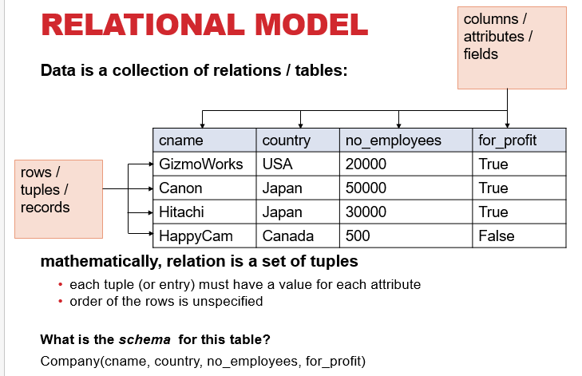
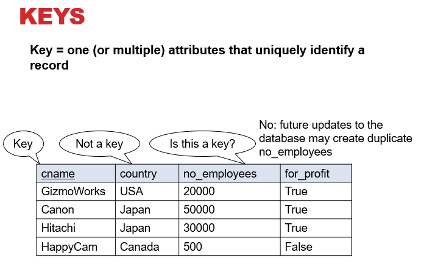

# Relational Data Models and Query Languages

- **What is a database**
  - A collection of records storing related data.
- **What is a DBMS**
  - An application program that allows us to manage efficiently the collection of data files.

## Data Models

- **Relational:** Data represented as relations
- **Semi-structured(JSON/XML):** Data represented as trees
- **Key-value Pairs** Used by NoSQL systems
- **Graph**
- **Object-oriented**

## Databases vs. Data Structures

What are some important distinctions between database systems, and data structure systems?

- **Structure:**
  - **OOP** concerned with _physical structure_.
  - **DBMS** concerned with _conceptual structure_.
- **Operations**
  - **OOP** low level
  - **DBMS** restricts allowable operations. Efficiency and data control
- **Data Contstaints:** Enforced typing allows us to maximize our memory usage and to be confident our operations are successful.

### 3 Element of Data Models

- **Instance** - The actual data
- **Schema** - Describe what data is being stored
- **Query Language** - How to retrieve and manipulate data

**Each attribute has a type.**

- Example types:
  - **Strings:** CHAR(20), VARCHAR(50), TEXT
  - **Numbers:** INT, SMALLINT, FLOAT
  - MONEY, DATETIME, ...
  - Few more that are vendor specific
- Statically and strictly enforced

> **KEY** - One or multiple _attributes_ that uniquely identify a record.

- **KEY** = **columns that uniquely identify tuple**
  - Usually we underline
  - A relation can have many keys, but only one can be chosen as primary key
- **Foreign Key**
  - Attribute(s) whose value is a key of a record in some other relation
  - Foreign keys are sometimes called **semantic pointer**

## Query Languaga

- **SQL**
  - Structed Query Language
  - Developed by IBM in the 70s
  - Most widely used language to query relational data
- **Other relational query languages**
  - Datalog, relational algebra
