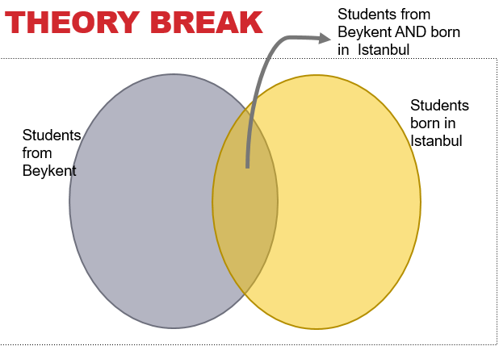
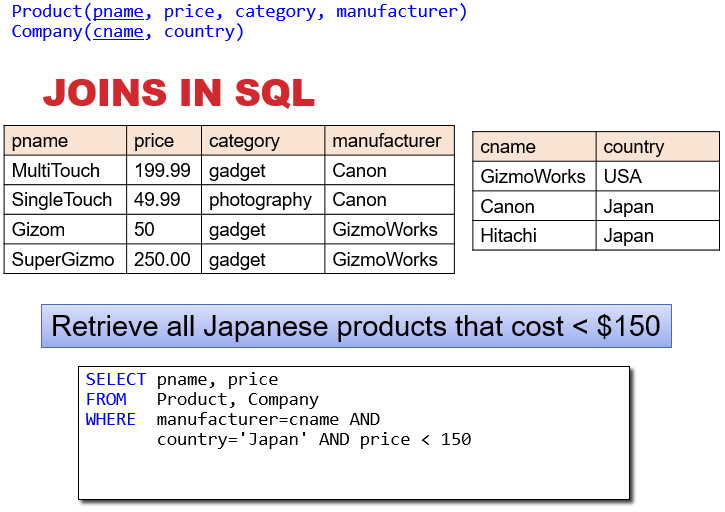
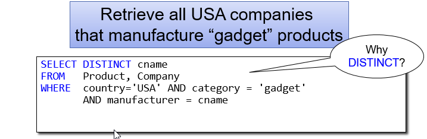
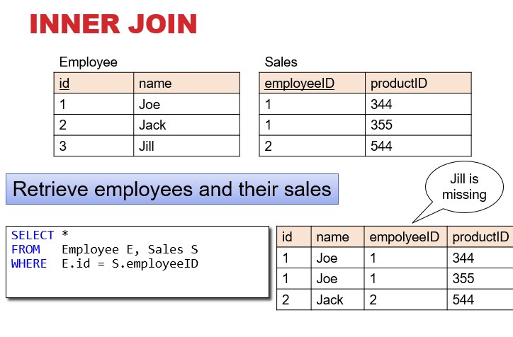
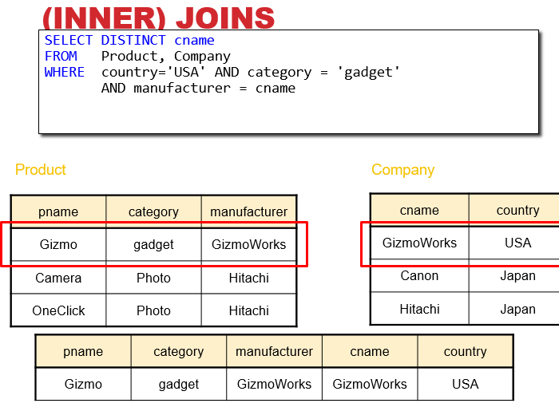
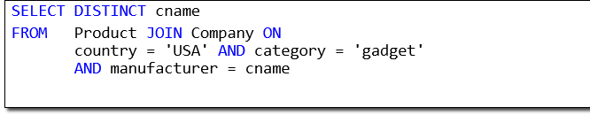

# JOINS

## Theory

We can think of accessing information through queries as some combination of functions.

- Consider a table of Istanbul students (with all relevant info):
  - How would we need to get the birth year of all Beykent students from Istanbul?
  - _Think of the file as a set of tuples_
  - Find the set of Beykent students and the set of students from Istanbul; find the intersection of these sets, return just the year from the birthday values of this set.
  - _What does this return?_
  - Years, but with many duplicates. Event though sets don't allow duplicates, the objects are unique.

- This was all for a single table.
- Data models specify how our data are stored and how the data are related.
- Need to utilize these relations, or the database was pointless.
- This involves a JOIN

## JOIN

- The JOIN is the way we indicate in a query how multiple tables are related.
  - Example, if we want all of the products and their relevant company information, we need to join those two tables.
  - The result of the join is all of the relevant information from both tables.
  - Join occurs based on the join condition.
  - This allows us to access information that comes from multiple tables.

## Joins in SQL

The standard join in SQL is sometimes called an **inner join**.

- Each row in the result _must come from both tables in the join_.
- Sometimes we want to include rows from only one of the two table: **outer join**.

These two queries are totally equivalent, just different syntax. We will see why we need another syntax. (for outer joins)

