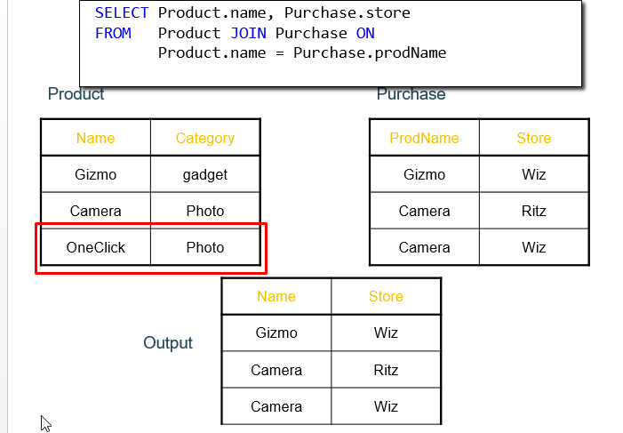

# JOINS

- The JOIN is the way we indicate in a query how multiple tables are related.
  - Example, if we want all of the products and their relevant companty information, we need to _join_ those two tables.
  - The result of the join is all of the relevant information from both tables.
  - Join occurs based on the join condition.
  - This allows us to access information that comes from multiple tables.

    SELECT *
    FROM Employee E, Sales S
    WHERE E.id = S.employeeID

    OR

    SELECT *
    FROM Employee E
    INNER JOIN Sales S
    ON E.id = S.employeeID

When we are quering with this ways (inner join), Jill is missing.

So, if we want to take Jill, we should query with **OUTER JOIN**

    SELECT *
    FROM Employee E
      LEFT OUTER JOIN
      Sales S
     ON E.id = S.employeeID

## Self-Joins & Tuple Variables

Find USA companies that manufacture both products in the _gadgets_ and _photo_ category.

Joining Product with Company is insufficient: need to join Product, with Product and with Company

When a relation occurs twice in the FROM clause we call it self-join; in that case we must use tuple variables.

## OUTER JOINS

- **Left Outer Join**
  - Include tuples from tableA even if no match
- **Right Outer Join**
  - Include tuples from tableA even if no match
- **Full Outer Join**
  - Include tuples from both even if no match
- **In all cases**
  - Patch tuples without matches using NULL
