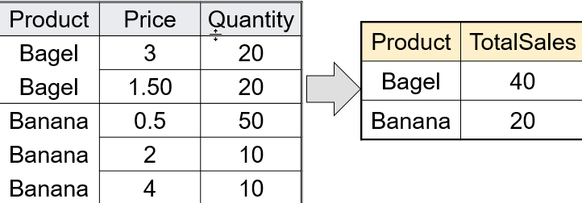

# AGGREGATES

## Grouping And Aggregation

    SELECT product, Sum(quantity) AS TotalSales
    FROM Purchase
    WHERE price > 1
    GROUP BY product

> Everything in SELECT must be either a GROUP-BY attribute, or an aggregate.

1. Compute the FROM and WHERE clauses.
2. Group by the attributes in the GROUP BY
3. Compute the SELECT clause: grouped attributes and aggregates.
