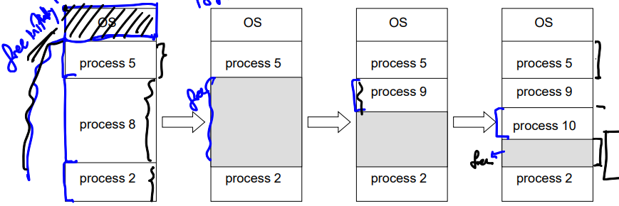
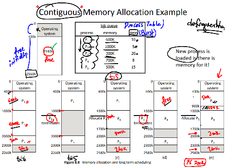
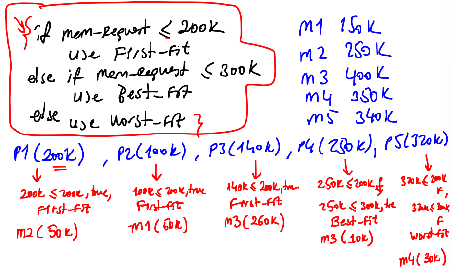

<h1> MEMORY MANAGEMENT </h1>

- All data in memory before and after processing.
- All instruction in memory in order to execute.
- Memory management determines what is to be in memory.
- Memory management activities:
  - Keeping track of which parts of memory are currently being used and by which process.
  - Deciding which processes and data to move into and out of memory.
  - Allocating and deallocating memory space as needed by running processes.

---

<h2> Memory-Management Unit (MMU) </h2>

- Hardware device that at run time maps virtual address to physical address.
  - <b>Logical address -></b> Generated by the CPU; also referred to as virtual address.
  - <b>Physical address -></b> Address seen by the memory unit.
- The user program deals with <b>logical</b> addresses; it never sees the <b> real physical addresses </b>
  - Execution-time binding occurs when reference is made to location in memory.
  - Logical address bound to physical addresses.

---

<h2> Contiguous Allocation </h2>
As a single seperate slot to each process.

- Multiple-partition Allocation
  - When a process arrives, it is allocated memory from a large enough memory free space to place it.
  - When a process terminates, frees its partition, adjacent fee partitions combined.

---

<h2> Dynamic Storage-Allocation Problem </h2>

How to satisfy a request of size n for a Process from a list of free holes?

- <b> First-Fit: </b> Allocate the first hole that is big enough.
- <b> Best-Fit: </b> Allocate the smallest hole that is big enough; must search entire list, unless ordered by size
  - Produces the smallest leftover hole.
- <b> Worst-Fit: </b> Allocate the largest hole; must also search entiry list.
  - Produces the largest leftover hole.

First-fit and Best-fit better than Worst-fit in terms of speed and storage utilization.

---

<h2> Fragmentation </h2>

- Total memory space exist to satisfy a request, but it is not contiguous.
  - External Fragmentation

Reduce external fragmentation by compaction

        Shuffle memory contents to place all free memory together in one large block.
        Compaction is possible only if relocation is dynamic, and is done at execution time.
