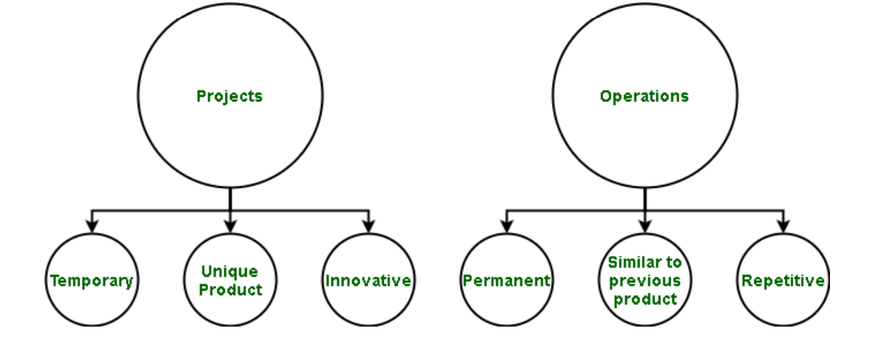
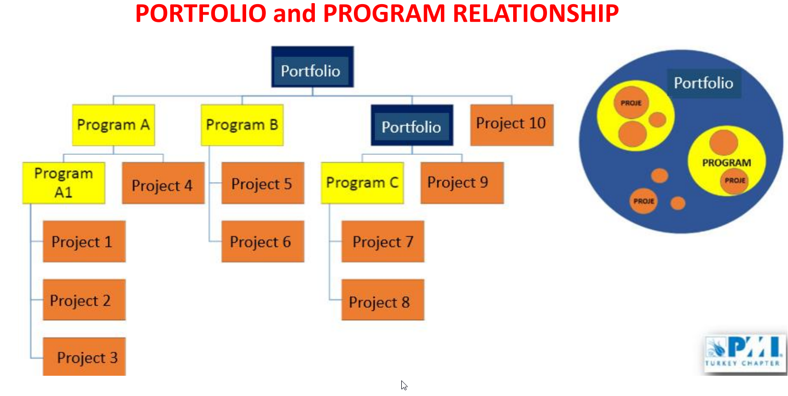
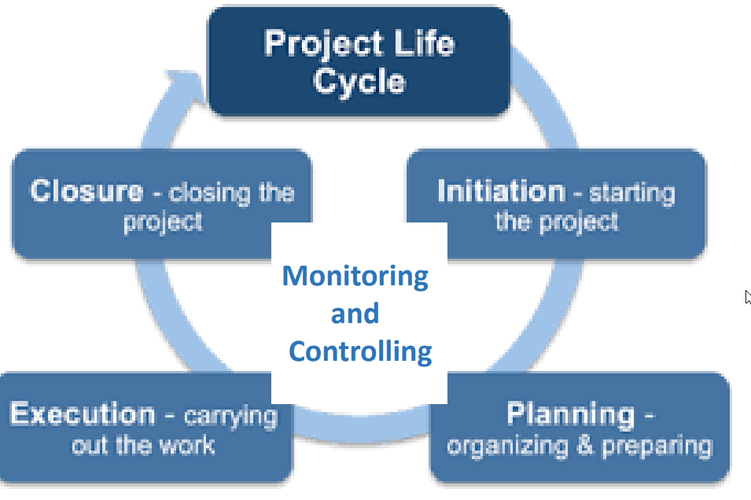
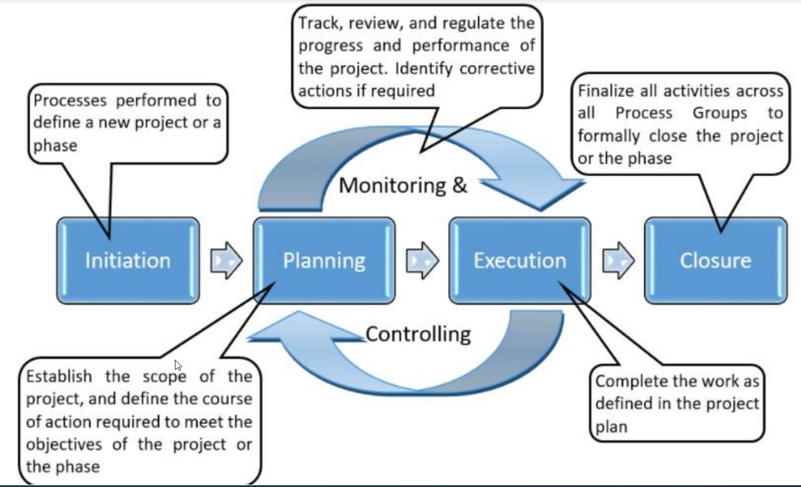
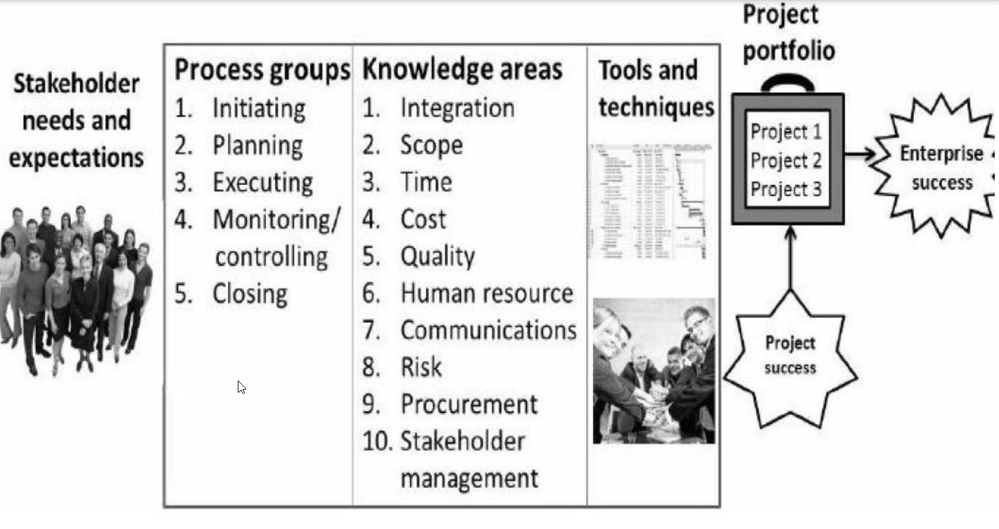
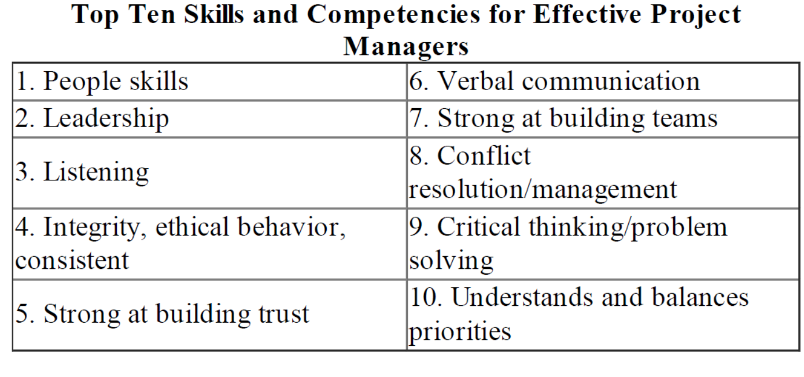

# Project Management

## WEEK - 1

**Project Managers** can be seen in many industry sectors including agriculture and natural resources exc.

**Business Owners** definitely need to have some project management skills. With all successful businesses, the product or service being delivered to the **customer meets their needs** in many ways. The product or service is of the
**quality** desired, the **costs** are aligned with what the consumer expected, and the **timeliness** of the product or service meets the deadline for the buyer of that item. Some examples for _Business Owners_

- Restaurant Owner / Manager
- Construction Manager
- Engineers
  - Engineers use many project management skills, especially when they must specify functional requirements. They demonstrate attention to quality as they evaluate a design’s overall **effectiveness, cost, reliability, and safety** similar to the Project manager reviewing the criteria for the customer’s acceptance of delivery of the product or service.
- Software Developers
  - Software developers use project management skills to develop the requirements for the software, identify and track the product development tasks, communicate within the development team and with clients, test cases, and manage quality, the schedule, and resources.

### What is Project?

**A project is a temporary endeavor undertaken to provide a unique product or service.** This is the definition from the **The Guide to the Project Management Body of Knowledge
(PMBOK®)** published by the **Project Management Institute (PMI®)**.

The fundamental nature of a project is that it is a “temporary endeavor undertaken to
create a unique product, service, or result.” Projects are distinguished from operations and
from programs. The third characteristic of a project: progressive elaboration.

- Temporary Endeavor (Effort)
- Unique Deliverables
- Progressive Elaboration

### A Project Versus an Operation

### Project Versus a Program

### What is Management?

**Project Management**: the applications of knowledge, skills, tools and techniques
to project activities to meet project requirements.

**Project Management**: the planning, monitoring and control of all aspects of the
project. AND the motivation of all those involved in it to achieve the project
objectives on time and cost, quality and performance.

**Project Management** is the complete set of tasks, techniques, tools, applied
during Project Execution

### Process of Project Management

1. Project Initiation
2. Project Planning
3. Project Execution
4. Project Monitoring and Control
5. Project Closure

### Notable Projects in USA

- Manhattan Project - Development of the first nuclear weapon
- Polaris missile Project - an ICBM control system
- Human Genome Project - To map the human genome
- Project Apollo - Landing a man on the moon
- Channel Tunnel Project
- Central Artery Project - underground highway Project in Boston

### Non-industrial Project

- Educational Project
- Irrigation Project - GAP Watering
- Solar Project

### What is Program?

A program refers to multiple projects which are managed
and delivered as a single package.

A program manager is therefore tasked with overseeing
all the projects comprising the program – to ensure it
achieves its outcomes.

**Structure**:
The components of a project are specific and exact.
The scope and goals of a project are well-defined – while programs are typically less
clear-cut.
Because a program covers multiple projects – a program team tends to be larger as it
also incorporates the project managers and their project team members

**Effort**:
A project represents a single, focused endeavour.
A program is a collection of projects – together all the projects form a connected
package of work. The different projects balance each other to assist the program in
achieving its overall objectives. It’s likely the different projects within a program will
overlap – the program manager will therefore assess these overlaps and work with the
relevant project managers to ensure the program’s smooth progression

## WEEK - 2

### Why do we need Project Management?

- Exponential increase in human knowledge
- Global demand for products and services
- Global competition
- The need to use teams rather than individuals in order to realize these items

### Benefist of Project Management?

- Project Managers are well equipped with the knowledge and tools to successfully deliver project products on time.
- This creates customer satisfaction and improves customer relations.
- Total cost is reduced and timely delivery is more assured.
- Stress in the work environment decreases and morale rises.

### History of Project Management

- 1917 - Gann Chart
- 1931 - Hoover Dam (Arizona)
- 1940's - Manhattan Project
- 1950's
  - Military weapon systems and startups
    project complicated by the space race
    needs
  - Program Evaluation and Review
    Technique (PERT) instead of Gantt
    Chart
    (Polaris Missile Program)
  - Critical Path Method (CPM)
- 1960's
  - Earned Value method
    developed for the U.S.
    defence projects by
    economists
  - Usage of Work Breakdown
    Structure (WBS) methods
- 1970's
  - Project Management Institute (PMI)
    was established. (1969)
  - The use of tools of Modern project
    management in the construction
    industry has increased rapidly.
  - KAI-ZEN system practiced in Japan
    system (change for better) was used to
    produce high-quality products at
    competitive prices.
- 1980's
  - Successful quality control methods and
    Total Quality Management was created by
    examining the quality methods in Japan.
  - Risk management is taken as a part of
    project management
  - Project Management Institute, published
    PMBOK (Project Management Knowledge
    Guide)
- 1990's
  - Development of quality methods such as
    ISO 9000, Lean manufacturing and Six
    Sigma. (6s: Statistical training based
    approach)
  - Compliance with the strategic plan
  - Project networks (portfolio and program
    management)
- 2000's
  - Distribution of Project Management knowledge to
    everyone and every field
  - Project Managers' need for more business
    management knowledge in the field of budget and
    finance
  - The increasing importance of Human Resources,
    the value placed on the workforce, role modeling
    and leadership skills become key for PM
  - Ability to adapt to change, change management
    Declining PY education to primary education

---

- A project is an investment made on a package of **interrelated** time bound activities; consequently, a project becomes a **time-bound** task.
- Every project has two phases basically; the first is - **preparation** and _construction_, and the second, its **operation**.
- Project **planning** deals with specified tasks, operations or activities which must be performed to achieve the **Project goals.**
- Any project that we may consider has an objective, or a set of objectives, to achieve. It has to be operated within a given set of rules, regulations, constraints and restrictions.
- Implementation (application) of projects needs resources or inputs. Every projectconverts the given inputs into outputs through a process of implementation. The outputs in the short run lead to outcomes, which, in the long run, should result in impact.

**Project Life Cycle**

## WEEK - 3

### Project Constraints

Every project is constrained in different ways. Some Project managers focus on
scope, time, and cost constraints. These limitations are sometimes referred to in
project management as the **triple constraint**.

- **Scope**: What work will be done as part of the project? What unique product, service,
  or result does the customer or sponsor expect from the project?

- **Time**: How long should it take to complete the project? What is the project’s
  schedule?

- **Cost**: What should it cost to complete the project? What is the project’s budget?
  What resources are needed?

Other people focus on the quadruple (fourfold)
constraints, which adds quality as a fourth constraint.

- **Quality**: How good does the quality of the products or
  services need to be? What do we need to do to satisfy
  the customer?

The PMBOK® Guide, suggests these
four constraints plus **risk** and **resources**,
(total six constraints) but states that there
may be others as well, depending on
the project.

The triple constraint goals — **scope (coverage), time, and cost** — often have a specific
target at the beginning of the project.
It might be needed to increase the budget to meet scope and time goals or decrease
the scope to meet time and budget goals.

The other three constraints— **quality, risk, and resources** — affect the
ability to meet scope, time, and cost goals. Projects by definition, involve **uncertainty**
and **resources**, and the customer defines **quality**.
No one can predict with one hundred percent accuracy what risks
might occur on a project. _Resources_ (people) working on the project
might produce different results, and material resources may vary as
well. Customers cannot define their _quality_ expectations in detail for
a project on day one. These **three constraints often affect each other**
as well as the scope, time, and cost goals of a project.

**Stakeholders**

**Stakeholders** can be roughly sorted into **positive stakeholders**, whose interests
and goals align with your project; **negative stakeholders**, whose interests are harmed
or compromised by your project’s process or results; and **tangential stakeholders**,
who have an interest in some specific element of your project but are not affected by
the project as a whole.

- Project Sponsors
- Customer
- Project Manager
- Project team members
- The supervisor or manager of the PM
- End User(s)
- suppliers
- Knowledge Areas

- Ethics
