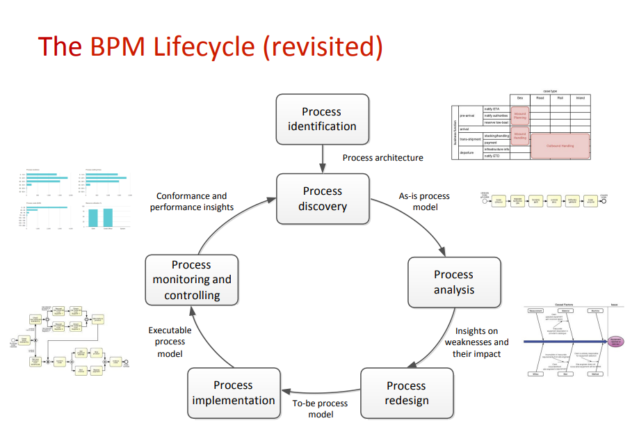

<h1> Process Management </h1>

<h2> Process Management Initiatives </h2>

- These initiatives improve business procedures, resulting in improved efficiencies and cost structures.

  - CPI (Continuous Process Improvement) Systems
    - Reduces material cost and to a lesser degree Labor costs
  - Vendor/JIT (Just In Time[Inventory])
    - Reduces material costs and administrative overhead
  - QIT (Quality Initiative Training)
    - Reduces labor costs
  - Channel Support Systems
    - Increases the effectiveness of the sales
  - Concurrent Engineering
    - Reduces R&D cycle time, the time needed to move products on the perceptual map and to change MTBF spesification.

---

<h2> What is the process? </h2>

- It means the beginning and end of he job.
- It is a cluster of sub-works and detail works required to do a job.

---

Process Management for doing the best for competition, finding the better, to take precautions in advance.

---

<h2> Basic Elements of the Process </h2>

1. Suppliers: Persons or organizations that provide one or more of the inputs of the process.
2. Inputs
3. Outputs
4. Clients
5. Process Performance Criteria
6. Customer needs and expectations
7. Process activities

---

<h3> Benefits of Process Management </h3>

- The inefficiency of the resources used is prevented or minimized.
- Managed jobs become systematic.
- Encourages customer-oriented management.

<h3>  Process Features </h3>

- Definable
- Can be measured
- A logical work sequence
- Connected to each other
- Recursive capable

All the process needed managing, planning, measuring and improving.

- The six sigma system recognizes three major strategies for enchancing process quality.

1. Process Improvement
2. Process Design
3. Process Management

---

<h3> Process Hierarchy </h3>

1. Main Processes
2. Processes
3. Sub processes
4. Process activities are carried out by one or more people in the same function.

---

<h2> Process Management Organizational Structure </h2>

- Process Owner
  - The process responsible is the person who carries out, represents and works for the process owner in the organization.
- Process Team

---

- Diagrams
  - Process diagram often depics simple notation of the basic workflow a process
- Maps
  - More precision than a diagram
- Models
  - Represents the performance of what is being modelled

---

<h2> Process Flow Maps </h2>

- Relationship Map
  - The basic input output among the functions within the process shows the customer supplier relationships. The relationship map can be prepared at every level in the organization.
- Cross-functional Process Map
  - Shows the works done to convert certain inputs into desired outputs and follows the order according to their functions and enables us to visualize the process by being dependent on the flow.
