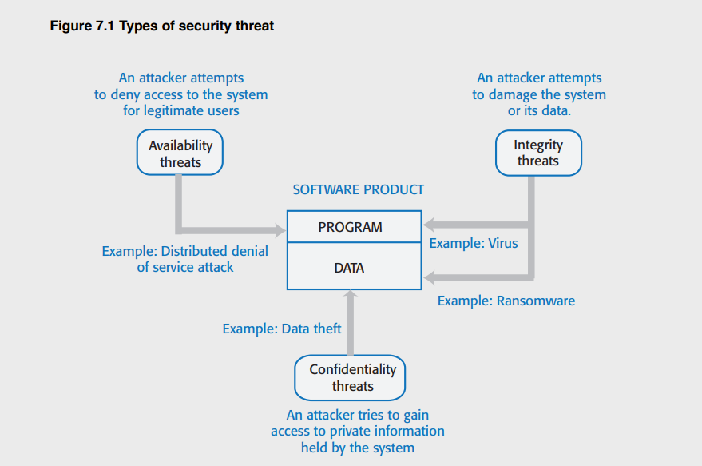
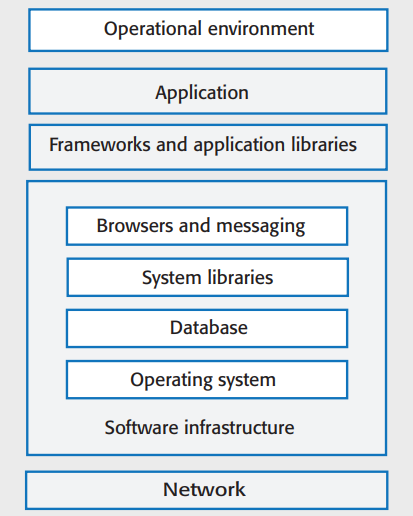
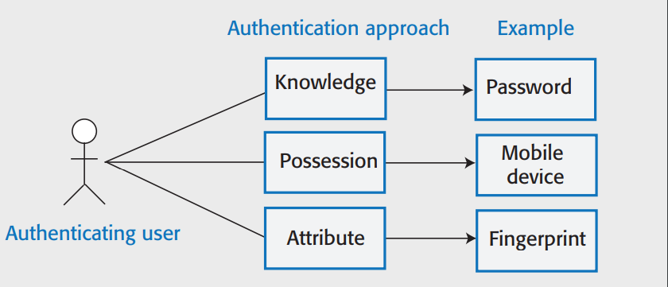
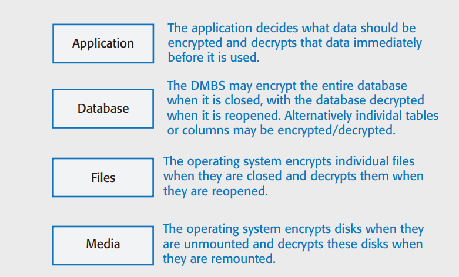

<h1> Security & Privacy </h1>

<h2> Software Security </h2>

- Software security should always be a high priority for product developers and their users.
- If you don't prioritize security, you and your customers will inevitably suffer losses from malicious attacks.

- Availability Threath: An attacker attemps

<h3> Types of Security Threat </h3>

<h3> System Infrastructure Stack </h3>

---

<h3> Security Management </h3>

- Authentication & Authorization
- System Infrastructure Management
  - Infrastructure software should be properly configured and security updates that patch vulnerabilities should be applied as soon as they become available.
- Attack Monitoring
  - The system should be regularly checked for possible unauthorized access. If attacks are detected, it may be possible to put resistance strategies in place that minimize the effects of the attacks.
- Backup
  - This can then be restored after an attack.

<h3> Operational Security </h3>

- Operational security focuses on helping users to maintain security.User attacks try to trick users into disclosing their credentials or accessing a website that includes malware such as a key-logging system.
- Operational security procedures and practices:
  - Auto-logout
  - User command logging
  - Multi-factor authentication

<h3> Injection Attacks </h3>

- Injection attacks are a type of attack where a malicious user uses a valid field to input malicious code or database commands.

<h3> SQL Poisoning Attacks </h3>

- SQL poisoning attacks are attacks on software prducts that use an SQL database.

---

<h2> Authenticaton </h3>

- Authentication is the process of ensuring that a user of your system is who thet claim to be.

<h3> Authentication Methods </h3>

- Knowledge-based Authentication
- Possession-based Authentication
  - The relies on the user having a physical devise that can generate or display information that is known to the authentication system.
- Attribute-based Authenticaton
  - Based on a unique biometric attribute of the user, such as a fingerprint.
- Multi-factor Authenticaton
  - Combines these approaches and requires users to use more than one authentication method.

<h3> Weakness of password-password based </h3>

        Insecure Passwords
        Phishing Attacks
        Password Reuse
        Forgotten Passwords

<h3> Authorization </h3>

- Authentication involves a user proving their identity to a software system.

- Authorization is a complementary process in which that identity is used to control access to software system resources.
  - For example, if you use a shared folder on Dropbox, the folder's owner may authorize you to read the contents of that folder.

<h3> Encryption </h3>

- Encryption is the process of making a document unreadable by applying an algorithmic transformation to it.
  - Symmetric Encryption
    - In a symmetric encryption scheme, the same encryption key is used for encoding and decoding the information that is to be kept secret.
  - Asymmetric Encryption
    - Asymmetric encryption, does not require secret keys to be shared.
- Asymmetric encryption can also be used to authenticate the sender of a message by encrypting with a private key and decrypting it with the corrsponding public key.

---

<h2> TLS & Digital Certificates </h2>

- The https protocol is a standard protocol for securely exchanging texts on the web. It is the standard http protocol plus an encryption layer called TLS (Transport Layer Security). This encryption layer is used for 2 things:

  - to verify the identity of the web server.
  - to encrypt communications so that they cannot be read by an attacker who intercepts the messages between the client and the server.
    <h3> Digital Sertificates </h3>

    - Subject Information
    - Certificate authority Information
    - Certificate Information
    - Digital Signature
    - Public Key Information

- TLS; the digital certificate that the server sends to the client includes the server's public key. The server also generates a long random number, encrypts it using its private key and sends this to the client.

---

<h3> Encryption Levels </h3>

<h2> Key Management </h2>

- Key management is the process of ensuring that encryption keys are securely generated, stored and accessed by authorized users.

<h3> Long-Term Key Storage </h3>

- Business may be required by accounting and other regulations to keep copies of all of their data for several years.
  - For example, in the UK, tax and company data has to be maintained for at least six years, with a longer retention period for some types of data. Data protection regulations may require that this data be stored securely, so the data should be encrypted.

<h3> Data Protection Principles </h3>

- Awareness & Control
  - Users of your product must be made aware of what data is collected when they are using your product, and must have control over the personal information that you collect from them.
- Purpose
  - You must tell users why data is being collected and you must not use that data for other purposes.
- Consent
  - You must always have the consent of a user before you disclose their data to other people.
- Data Lifetime
  - You must not keep data for longer than you need to. If a user deletes their account, you must delete the personal data associated with that account.
- Secure Storage
  - You must maintain data securely so that it cannot be tampered with or disclosed to unauthorized people.
- Discove & Error Correction
  - You must allow users to find out what personal data that you store. You must provide a way for users to correct errors in their personal data.
- Location
  - You must not store data in countries where weaker data protection laws apply unless there is an explicit agreement that the stronger data protection rules will be upheld.

---

<h2> KEY POINTS </h2>

- Security is a technical concept that relates to a software system's ability to protect itself from malicious attacks that may threaten its availability, the integrity of the system and/or its data, and the theft of confidental information.
- Common types of attack on software products include <b>injection attacks, cross-site scripting attacks, session hijacking attacks, denial of service attacks and brute force attacks.</b>
- Authentication may be based on something a user knows, something a user has, or some physical attribute of the user.
- Authorization involves controlling access to system resources based on the user's authenticated identity.
- Symmetric encryption involves encrypting and decrypting information with the same secret key. Asymmetric encryption uses a keypair - a private key and public key. Information encrypted using the public key can only be decrtpyed using the private key.
- A major issue in symmetric encrypion is key exchange. The TLS protocol, which is used to secure web traffic, gets around this problem by using asymmetric encryption for transferring information used to generate a shared key.
- If you product stores sensitive user data, you shuld encrypt that data when it is not in use.
- A key management system stores encryption keys. Using a KMS is essential because a business may have to manage thousands or even millions of keys and may have to decrypt historic data that was encrypted using an obsolete encryption key.
- Privacy is a social concept that relates to how people feel about the release of their personal information to others.
- Data protection laws have been made in many countries to protect individual privacy. They require companies who manage user data to store it securely, to ensure that it is not used or sold withour the permisson of users, and allow users to view and correct personal data held by the system.
